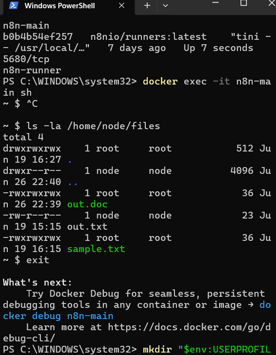

# Docker-n8n-lab
This repository documents my learning process while working with Docker, Docker networking, and n8n automation during my internship.

## Project goal
The goal of this project was to deploy a local automation environment using Docker and Docker Compose, connect multiple containers within the same network, and build a simple ETL workflow in n8n.

## Technologies used
- Docker Desktop
- Docker Compose
- n8n
- Python
- PowerShell
- WSL2 (Docker-desktop | linux)
- Shared Docker volumes

## What I implemented
- Installed and configured Docker Desktop.
- Created and started n8n containers.
- Connected containers through a shared Docker network.
- Mounted a local folder into the container.
- Created an n8n workflow for file processing.
- Used a Python script inside an n8n node.
- Generated output files from the processed input.

## Workflow


## Repository structure
```text
Docker-n8n-lab/
├── README.md
├── workflow/
│   └── workflow.json
├── full-python-script/
│   └── script.py
└── docs/
    └── screenshots/
        ├── Docker-files.png
        ├── location-localhost.jpg
        ├── python-script.png
        └── result-of-node-configuration.png
